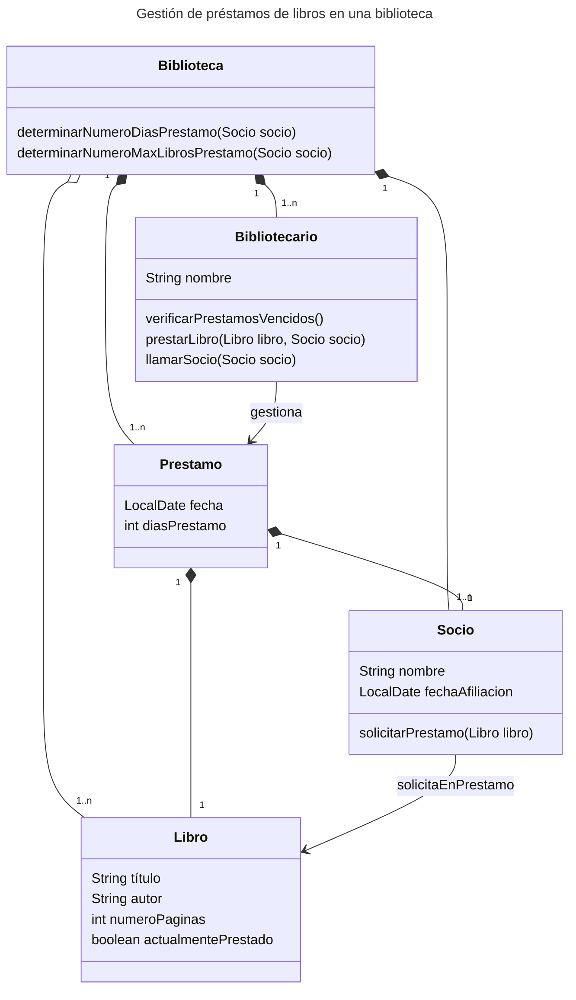

# Ejercicios del curso de Programación Orientada a Objetos

La biblioteca desea una aplicación que le ayude a gestionar los préstamos de libros a cada socio de la biblioteca.  La cantidad de libros que un socio puede pedir en préstamo de manera simultánea y las fechas de vencimiento para su devolución depende de la antigüedad de la membresía de cada socio a la biblioteca. Los bibliotecarios llevan el control de los libros en préstamos cuya fecha de devolución está a punto de vencer y realizan llamadas a los socios para recordarles que deben realizar la devolución prontamente. 

