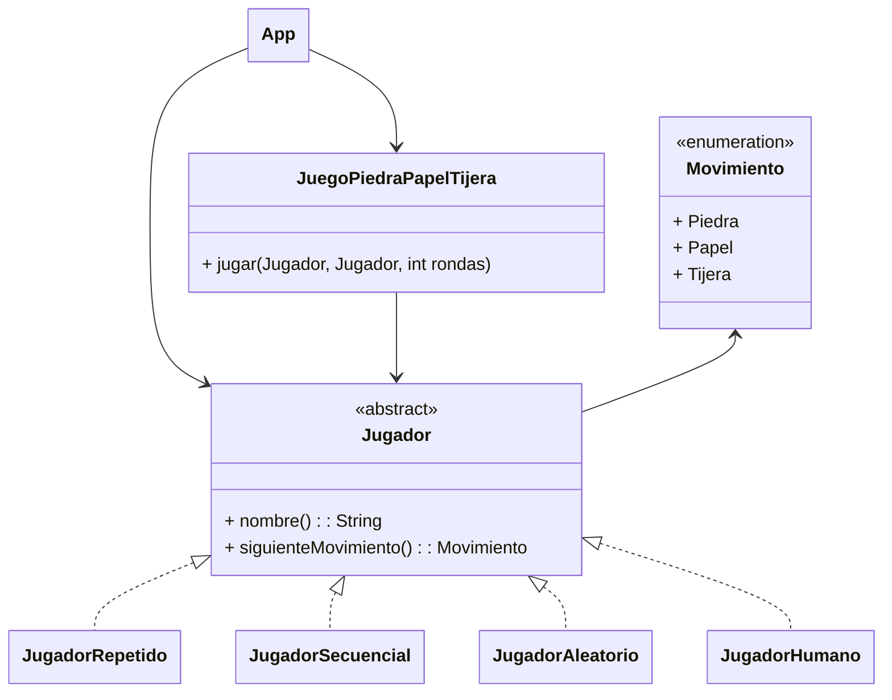

## Piedra, Papel y Tijera

Este proyecto muestra las ventajas de usar la abstracción y el polimorfismo 
aplicado a un juego de Piedra, Papel y Tijera

```mermaid
---
config:
    class:
      hideEmptyMembersBox: true
    title: Juego Piedra, Papel y Tijera
---
classDiagram
    %%direction LR
    class Movimiento {
        <<enumeration>>
        + Piedra
        + Papel
        + Tijera
    }
    class Jugador {
        <<abstract>>
        + nombre() : String
        + siguienteMovimiento() : Movimiento
    }
    class JuegoPiedraPapelTijera {
        + jugar(Jugador, Jugador, int rondas)
    }
    App --> JuegoPiedraPapelTijera
    App --> Jugador
    JuegoPiedraPapelTijera --> Jugador
    Movimiento <-- Jugador
    Jugador <|.. JugadorRepetido
    Jugador <|.. JugadorSecuencial
    Jugador  <|.. JugadorAleatorio
    Jugador <|.. JugadorHumano
```